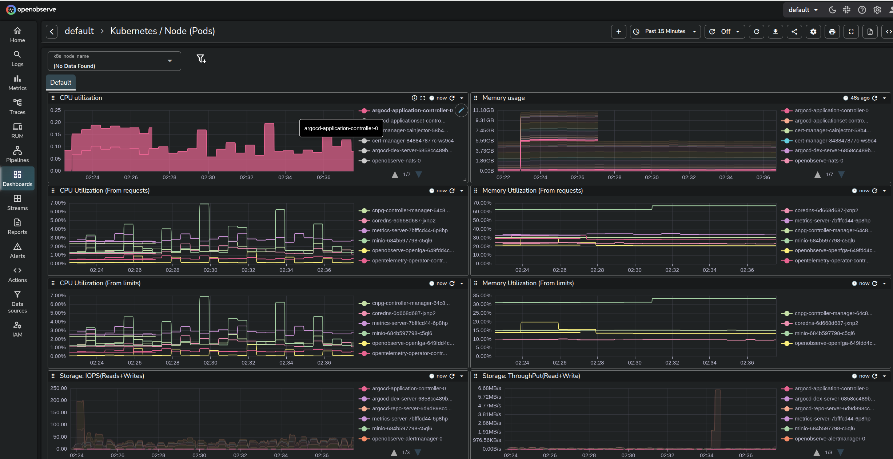

# OpenObserve HA Stack KubeCon 2026



> **⚠️ DISCLAIMER: WORK IN PROGRESS (Target: KubeCon 2026)**
> This is a Pre-Alpha Proof of Concept. Security settings are relaxed for local demonstration. API contracts are subject to change.

## 🎯 Introduction & Goal
**The Goal:** Run a **High-Availability, Multi-Tenant Observability stack** on a laptop using the exact same toolchain used in enterprise clusters.

This demo uses **Terraform** to bootstrap **ArgoCD**, which then manages complex stateful workloads (PostgreSQL/MinIO Operators) and **OpenObserve HA**, while a custom **Python** layer automates multi-tenant onboarding.

## 🏗 Tech Stack
* **Orchestration:** Microk8s & ArgoCD (GitOps)
* **Backing Services:** MinIO (S3) & CloudNativePG (PostgreSQL)
* **Observability:** OpenObserve (HA Mode)
* **Telemetry:** OpenTelemetry Collector (DaemonSet Agent + Deployment Gateway)
* **Automation:** Terraform & Python (`o2_manager.py`)

## ⚡ Quick Start

### 1. Prerequisites
* **OS**: Linux or macOS (Intel/Apple Silicon)
    * **Tested on:** Ubuntu 24.04.3 LTS
* **Microk8s** (Running with `dns`, `helm3`, `storage` enabled)
* **Terraform** (>= 1.0) & **Python 3**
* **Make**

### 2. Cluster Prep
Export your Microk8s config so Terraform can access the cluster.

```bash
make install-core
```
*(Or manually: `microk8s config > ~/.kube/config`)*

### 3. Deploy Core Infrastructure
Initialize Terraform and deploy the core services (ArgoCD, MinIO, DB, OpenObserve).

```bash
make install-prereqs
make install-o2
```

### 4. Connect & Bootstrap
Establish local port-forwards and use the Python automation to create Organizations, Service Accounts, and Roles.

```bash
# 1. Open tunnels to the cluster (in a separate terminal)
make start

# 2. Bootstrap Tenants (creates orgs, users, roles)
make bootstrap
```

### 5. Deploy Collectors & Demo
Deploy the OpenTelemetry Collector (Agent+Gateway) and the Astronomy Shop Demo.

```bash
make install-o2-collector
make install-demo
```

### 6. Access Credentials
Retrieve generated passwords for ArgoCD, MinIO, and OpenObserve.

```bash
make info
```

---

## 🧠 Automation Reference: `o2_manager.py`

This Python script automates the "Day 2" operations that Terraform cannot easily handle (dynamic API tokens, internal O2 logic).

### Created Resources (Bootstrap Mode)

Running `python3 o2_manager.py bootstrap` creates the following multi-tenant structure:

| Resource Type | Created Items | Details |
| :--- | :--- | :--- |
| **Organizations** | `default` (Super Admin)<br>`platform_k8s`<br>`platform_obs`<br>`devteam_1` | Isolated tenants. |
| **Dashboards** | K8s / Host Metrics | Imported automatically into all Orgs. |
| **Users** | `dev@devteam-1.com` | Sample user for the devteam tenant. |

## 📂 Structure
* `main.tf`: Core Infrastructure (Argo/O2/MinIO)
* `k8s/values/`: Helm value overrides.
    * `collector.yaml`: Unified Agent/Gateway config.
    * `astronomy-shop.yaml`: OTel Demo config.
    * `openobserve.yaml`: HA Configuration.
* `o2_manager.py`: Multi-tenant API automation.
* `scripts/`: Port-forwarding helper scripts.

## 📄 License
Licensed under the Apache License, Version 2.0.