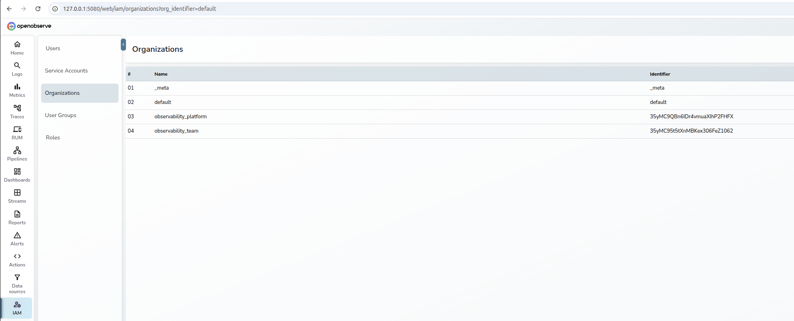

# OpenObserve HA Stack: Production in a Box



> **⚠️ DISCLAIMER: WORK IN PROGRESS (Target: KubeCon 2026)**
> This is a Pre-Alpha Proof of Concept. Security settings are relaxed for local demonstration. API contracts are subject to change.

## 🎯 Introduction & Goal

Most local observability stacks are "toys"—single containers that bear no resemblance to production.

**The Goal:** Prove that you can run a **High-Availability, Multi-Tenant Observability stack** on a laptop using the exact same toolchain used in enterprise clusters.

This demo uses **Terraform** to bootstrap **ArgoCD**, which then manages complex stateful workloads (PostgreSQL/MinIO Operators) and **OpenObserve HA**, while a custom **Python** layer automates multi-tenant onboarding.

## 🏗 Tech Stack
* **Orchestration:** Microk8s & ArgoCD (GitOps)
* **Backing Services:** MinIO (S3) & CloudNativePG (PostgreSQL)
* **Observability:** OpenObserve (HA Mode)
* **Automation:** Terraform & Python (`o2_manager.py`)

## ⚡ Quick Start

### 1. Prerequisites
* **Microk8s** (Running with `dns`, `helm3`, `storage` enabled)
* **Terraform** (>= 1.0) & **Python 3**
* **Make**

### 2. Cluster Prep
Export your Microk8s config so Terraform can access the cluster.

```bash
mkdir -p ~/.kube
microk8s config > ~/.kube/config
chmod 600 ~/.kube/config
```

### 3. Deploy Core Infrastructure
Initialize Terraform and deploy the core services (ArgoCD, MinIO, DB, OpenObserve).

```bash
make init
make apply
```

### 4. Connect & Bootstrap
Establish local port-forwards and use the Python automation to create Organizations, Service Accounts, and Roles.

```bash
# 1. Open tunnels to the cluster
./manage-local-connection.sh start

# 2. Bootstrap Tenants (creates orgs: platform, team1, team2)
python3 o2_manager.py bootstrap
```

### 5. Access Credentials
Retrieve generated passwords for ArgoCD, MinIO, and OpenObserve.

```bash
./manage-local-connection.sh info
```

### 6. Deploy Collectors
Now that tenants exist, deploy the OpenTelemetry Collectors.

```bash
make apply-collectors
```

---

## 🧠 Automation Reference

We use `o2_manager.py` to handle API logic that Terraform cannot (dynamic tokens, internal O2 resources).

* `bootstrap`: Sets up default Orgs, Streams, Roles, and Service Accounts.
* `show-all`: Dumps a JSON overview of the entire multi-tenant landscape.
* `cleanup-all`: **Destructive**. Purges all resources inside organizations.

## 📂 Structure
* `main.tf`: Core Infrastructure (Argo/O2/MinIO)
* `collectors/`: OTel Collector configurations
* `o2_manager.py`: Multi-tenant API automation
* `manage-local-connection.sh`: Connectivity helper

## 📄 License
Licensed under the Apache License, Version 2.0.